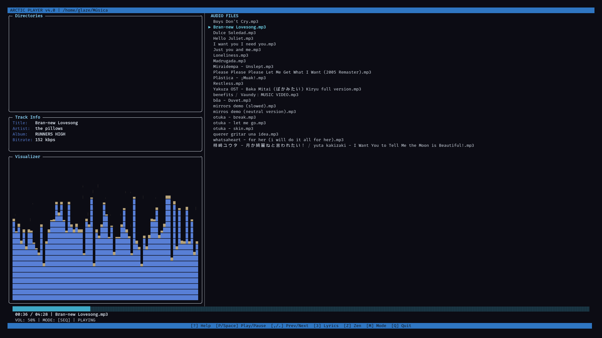
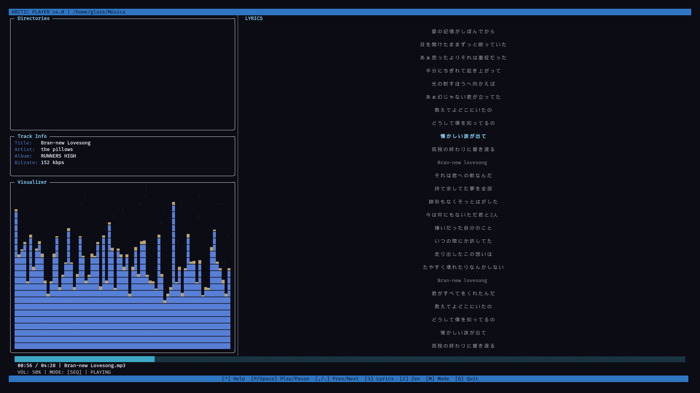
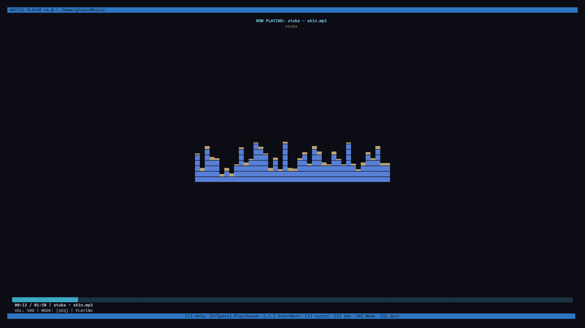
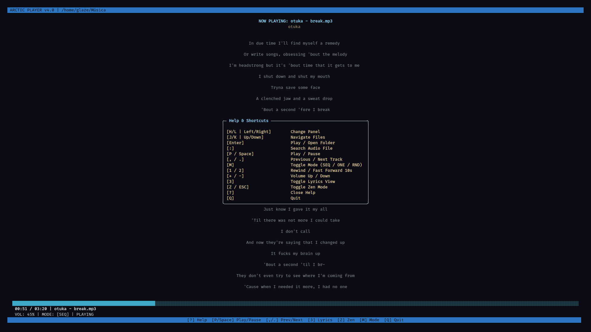

# ❄️ Arctic Player 🏔️

A lightning-fast, terminal-native music player built with Python. It strips away the bloat of heavy wrappers and directly leverages `mpv` via IPC sockets for a high-fidelity, uncompromising audio backend. The interface is powered by `curses`, delivering a minimalist and efficient experience.

<p align="center">
  
  
</p>
<p align="center">
  
  
</p>

## ✨ Core Features
- **Dual-Panel Navigation:** Seamlessly switch between your file browser and current playlist.
- **IPC Audio Engine:** Direct communication with `mpv` via JSON-IPC for low-latency control.
- **On-the-Fly Lyrics:** Integrated `3` key to fetch and display lyrics from `lrclib.net`.
- **Zen Mode:** Cleanest possible interface with `z` / `Esc` to focus only on the music.
- **Smart Metadata:** Local SQLite caching (WAL mode) for instant indexing of large libraries.
- **Repeat Modes:** Cycle through Sequence, One, and Random playback with a single key.

## 🛠️ Dependencies

Ensure the following are in your `$PATH`:

| Package | Purpose | Debian / Ubuntu | Arch Linux |
| :--- | :--- | :--- | :--- |
| **Python 3.8+** | Runtime | `sudo apt install python3` | `pacman -S python` |
| **mpv** | Audio Engine | `sudo apt install mpv` | `sudo pacman -S mpv` |
| **ffmpeg** | Metadata (`ffprobe`) | `sudo apt install ffmpeg` | `sudo pacman -S ffmpeg` |

## 📦 Installation

```bash
git clone [https://github.com/opendoto/arctic-player.git](https://github.com/opendoto/arctic-player.git)
cd arctic-player
python3 src/arctic.py

🎮 Keybindings

Arctic Player is designed for efficiency. Here are the actual controls:

Navigation
| Key | Action |
| :---: | :--- |
| h / l / Left / Right | Switch panel (Browser ↔ Playlist) |
| j / k / Up / Down | Navigate through files or tracks |
| Enter | Play selected track / Open folder |
| : | Search current view |

Playback & Volume
| Key | Action |
| :---: | :--- |
| p / Space | Toggle Play / Pause |
| , / . | Previous / Next track |
| 1 / 2 | Rewind / Fast Forward (10s) |
| + / - | Increase / Decrease Volume |
| m | Toggle Playback Mode (SEQ ➔ ONE ➔ RND) |

UI & System
| Key | Action |
| :---: | :--- |
| 3 | Toggle Lyrics view |
| z / Esc | Toggle Zen Mode |
| ? | Toggle/Close Help menu |
| q | Cleanup and Quit |
